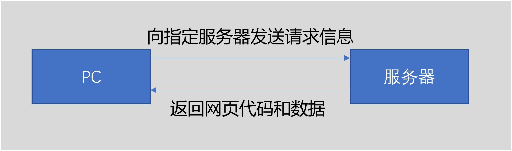

# SpiderFD220421
供研会爬虫工具分享活动
## 1. 爬虫工具知识体系
### 1.1. 浏览器、HTML与web请求过程
浏览器是HTML的翻译程序，它将结构化的HTML语言翻译成人类所擅长阅读的多媒体信息。 
HTML(HyperText Markup Language, 超文本标记语言)是一种最常用的网站显示语言，它通过结构化的语言描绘出一个网页最终的呈现效果，主要包括对象、属性和过程等。 
web请求过程很复杂，简单来说可以这么理解。 

指定服务器通过特定的url来实现 
请求信息包括：Request Headers、Data Form、Payload等。最常用的就是请求头，包含常见的Cookies和User-Agent。 
 
需要注意的是，客户端向服务器发送请求之后，服务器所返回的代码（html）语言会直接包含所需的数据，浏览器直接翻译即可。但有时代码是代码，数据是数据，需要通过某些过程在客户端进行组合、渲染成为我们看到的网页。有时代码和数据是分两步或多步进行请求的，这就涉及到异步加载的问题。

### 1.2. 爬虫程序实现思路
#### 1.2.1. 网站抓包与找规律
使用程序去爬取想要的数据，核心就是用程序模拟浏览器的行为，向服务器发送请求，并接收对应的信息，最终再提取出我们想要的数据。 
首先就是要知道浏览器向服务器发送了什么，这就需要使用浏览器的抓包工具，一般是在网页下按F12，就可以打开开发模式也就是抓包工具进行抓包，去分析浏览器在这一段时间里面做了什么事情。 
我们主要会用到的就是请求头，请求头里面的内容就是浏览器向服务器发送的请求指令，我们用找规律的形式去请求头里面找规律，并修改请求头的内容来得到我们想要的结果。

#### 1.2.2. Python常用的与爬虫相关的工具
requests 模拟浏览器的数据流进行爬取 
selenium 模拟人操作浏览器的过程去操作浏览器 
BeautifulSoap 拆解html语言结构、提取想要的数据的简化工具 
html 和 xpath 跟BeautifulSoap差不多的原理和功能，相对来说结合抓包工具使用起来会更简单一些 
re 无所不能的正则表达式工具，相当于额外学一门语言吧，正则表达式几乎能解决一切你想象的到的与字符串相关的问题（除了ML） 

## 2. 参考程序
### 2.1. Baidu_requests.py
基于requests的百度搜索简单爬虫
### 2.2. Douban_requests.py
基于requests和xpath的豆瓣爬虫
### 2.3. Eastmoney_requests.py
基于requests和re正则表达式的东方财富研报网爬虫
### 2.4. CNKI_selenium.py
基于selenium和xpath的中国知网爬虫
### 2.5. CNKI_requests.py
基于requests和BeautifSoup的中国知网爬虫